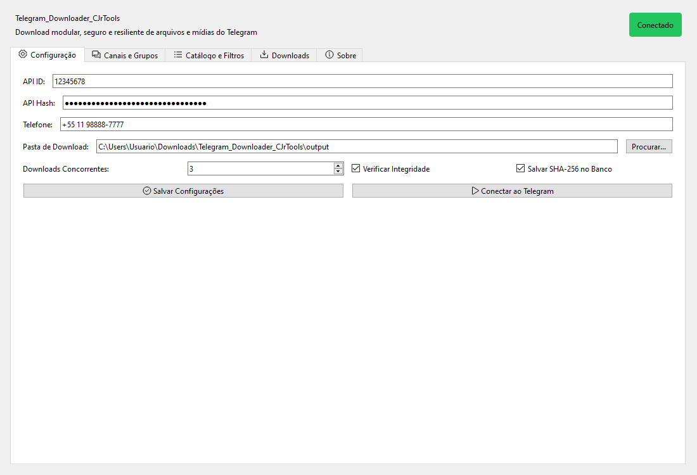
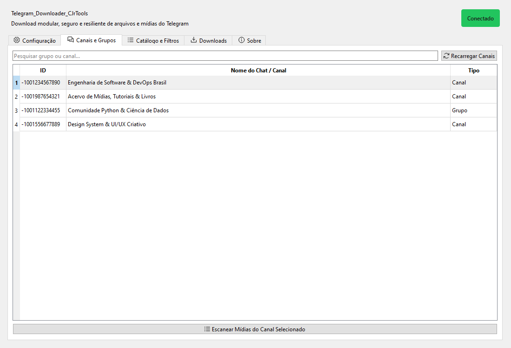
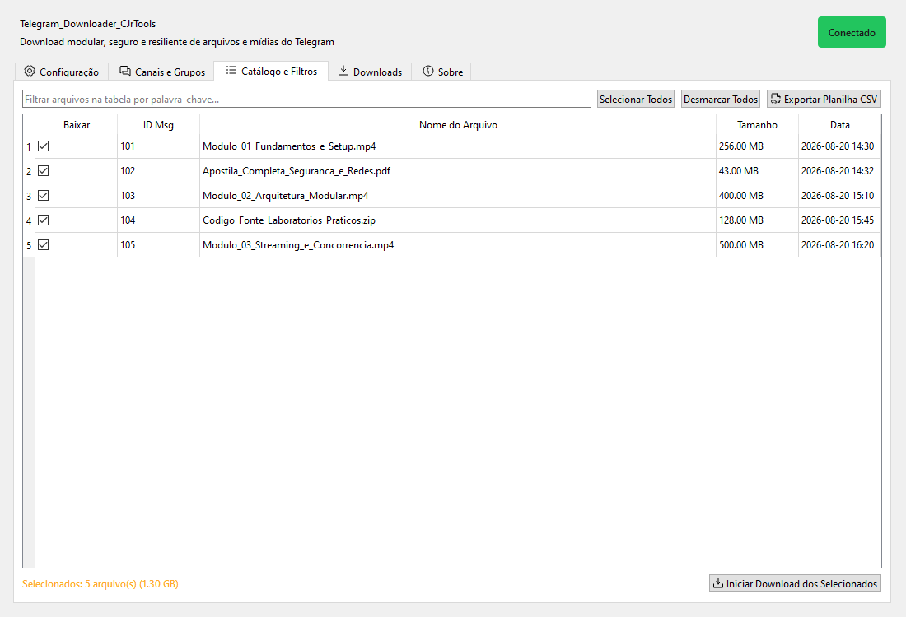
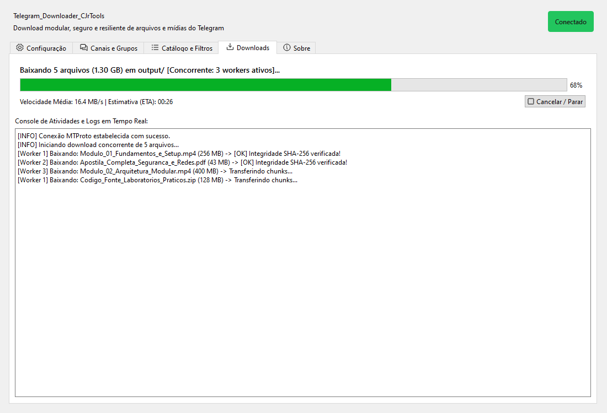
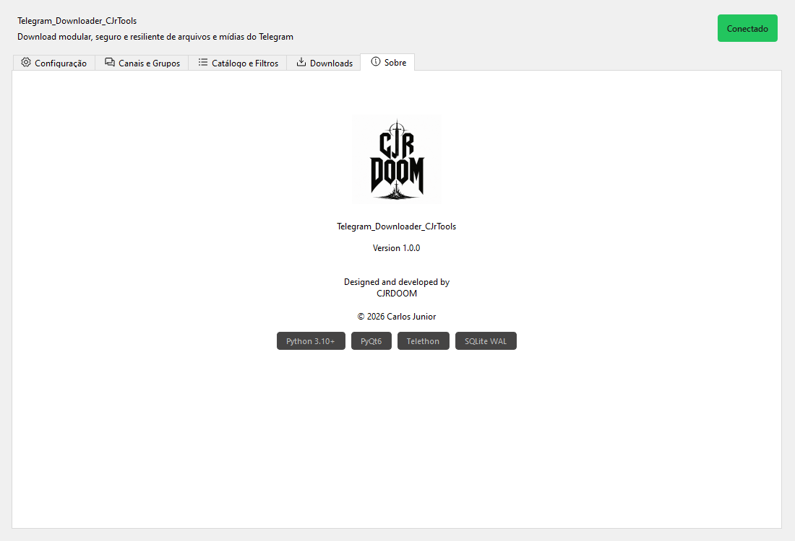

# Telegram_Downloader_CJrTools

Um downloader modular, seguro e resiliente de arquivos e mídias do Telegram via Telethon, com suporte a múltiplos downloads simultâneos, retomada de downloads interrompidos (*auto-resume*), download atômico (`.part`), verificação de integridade via SHA-256, exportação de catálogo completo para planilha CSV e **Interface Gráfica Moderna (GUI em PyQt6)** seguindo o Design System *Dark, Flat, Minimal, Geometric & Technical*.

---

## 🌟 Funcionalidades

- **Duas Formas de Uso**: Interface Gráfica moderna (GUI com Design System Dark/Flat) ou Linha de Comando (CLI para automação e servidores).
- **Design System Exclusivo**: Estética técnica e minimalista com paleta industrial (`#2E2D2D`, `#FFAC2B`), tipografia Inter/JetBrains Mono e ícones Phosphor.
- **Aba "Sobre" e Identidade Visual**: Guia dedicada com informações de versão, autoria (CJRDOOM / Carlos Junior) e integração de logo de alta fidelidade.
- **Download Concorrente e Streaming**: Gerenciamento de múltiplos downloads paralelos com controle de fluxo em tempo real via semáforo assíncrono.
- **Download Atômico com `.part`**: Arquivos são gravados com extensão temporária `.part` e promovidos atomicamente apenas após validação de tamanho e integridade, impedindo que arquivos parciais sejam tratados como completos em caso de queda de conexão ou energia.
- **Retomada Inteligente (*Resume*)**: Continuação automática de downloads interrompidos a partir do ponto exato onde pararam.
- **Varredura e Catálogo CSV**: Indexação prévia de todo o conteúdo com estimativa de volume em disco e exportação estruturada em CSV (com proteção nativa contra *CSV Formula Injection*).
- **Filtros Flexíveis**: Filtragem por inclusão (*whitelist*) e exclusão (*blacklist*) com normalização Unicode (insensível a acentos e maiúsculas/minúsculas).
- **Banco de Dados SQLite Local**: Controle transacional de estado de downloads, histórico e estatísticas em modo WAL.
- **Segurança e Isolamento**: Separação completa entre o código versionado e dados privados (sessões, logs, banco e configurações).
- **Executável Portátil (.exe)**: Disponível para download direto nas [Releases do GitHub](../../releases), sem necessidade de instalar Python.

---

## 📸 Demonstração da Interface Gráfica

Confira abaixo as telas da interface gráfica do **Telegram_Downloader_CJrTools**, construída sob a estética *Dark, Flat, Minimal, Geometric & Technical*:

### 1. Configuração e Conexão
*Parâmetros de autenticação MTProto, seleção de diretórios, concorrência e integridade.*


### 2. Seleção de Canais e Grupos
*Listagem e busca rápida de diálogos para varredura sob demanda.*


### 3. Catálogo de Mídias e Filtros
*Indexação de conteúdo com seleção por checkbox, estimativa de volume e exportação CSV.*


### 4. Downloads em Andamento
*Monitoramento em tempo real com barra de progresso, métricas de velocidade e console de logs.*


### 5. Guia "Sobre" e Identidade Visual
*Exibição da logo com contraste garantido, versão 1.0.0, autoria e stack técnica.*


---

## 🔒 Avisos de Segurança

> [!IMPORTANT]
> - **Arquivos `.session` são credenciais de acesso completas à sua conta do Telegram.** Nunca compartilhe ou envie seus arquivos `.session` para repositórios públicos.
> - **Nunca versione o arquivo `config.json` real** nem exponha seu `api_id`, `api_hash` ou número de telefone.
> - **Arquivos baixados são conteúdo externo:** O programa não executa automaticamente os arquivos baixados. Mantenha cautela ao abrir arquivos executáveis ou scripts baixados de canais de terceiros.
> - **Princípio do Menor Privilégio:** Nunca execute este aplicativo com privilégios administrativos (`Administrator` / `root` / `sudo`).

Para mais detalhes e procedimentos de relato de vulnerabilidades, consulte o [SECURITY.md](SECURITY.md).

---

## 📋 Requisitos

- **Python 3.10+** (para quem executa o código-fonte).
- Sistema Operacional: Windows, Linux ou macOS.
- Credenciais de API do Telegram (`api_id` e `api_hash`) obtidas em [my.telegram.org](https://my.telegram.org).

---

## 🚀 Instalação e Execução

### Opção 1: Baixar o Executável Pronto (Recomendado para usuários finais)
1. Acesse a aba **[Releases](../../releases)** deste repositório.
2. Baixe o arquivo `Telegram_Downloader_CJrTools.exe` (e confira o hash em `SHA256SUMS.txt`).
3. Execute o programa normalmente com dois cliques.

---

### Opção 2: Executar via Código-Fonte (Desenvolvedores)

1. Clone o repositório:
```bash
git clone https://github.com/carlosjrgit/Telegram_Downloader_CJrTools.git
cd Telegram_Downloader_CJrTools
```

2. Crie e ative um ambiente virtual:
```bash
# Windows (PowerShell)
python -m venv venv
.\venv\Scripts\Activate.ps1

# Linux / macOS
python3 -m venv venv
source venv/bin/activate
```

3. Instale as dependências:
```bash
pip install -r requirements.txt
```

4. Inicie o programa:
```bash
# Para abrir a Interface Gráfica (GUI):
python gui_main.py
# ou:
python main.py --gui

# Para rodar no Terminal (CLI tradicional):
python main.py
```

---

## 🛠️ Como Compilar o seu próprio Executável (.exe)

Para gerar o arquivo `Telegram_Downloader_CJrTools.exe` autônomo localmente:

```bash
# 1. Instale as dependências de build
pip install -r requirements-dev.txt

# 2. Execute o script de compilação
python build_exe.py
```
O executável compilado e seus respectivos hashes SHA-256 serão gerados na pasta `dist/` (`SHA256SUMS.txt`).

---

## 📁 Localização dos Dados do Usuário

Por padrão, a aplicação isola arquivos de sessão, banco de dados e logs na área de dados da conta do usuário (`platformdirs`):

- **Windows**: `%LOCALAPPDATA%\Telegram_Downloader_CJrTools\`
- **Linux**: `~/.local/share/Telegram_Downloader_CJrTools/`
- **macOS**: `~/Library/Application Support/Telegram_Downloader_CJrTools/`

*(Nota: Caso existam arquivos legados locais no diretório da aplicação, eles serão detectados e preservados automaticamente).*

---

## 🧪 Testes e Qualidade

```bash
# Instale as dependências de desenvolvimento
pip install -r requirements-dev.txt

# Execute a suíte de testes unitários
python -m unittest discover tests

# Análise estática de código (Linter)
python -m ruff check .

# Varredura de segurança SAST
python -m bandit -r . -c pyproject.toml
```

---

## 📄 Licença

Este projeto é disponibilizado para uso pessoal e educacional. Consulte o arquivo [LICENSE.example](LICENSE.example) para termos de uso.
